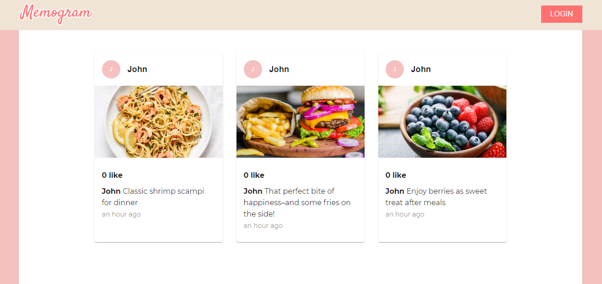
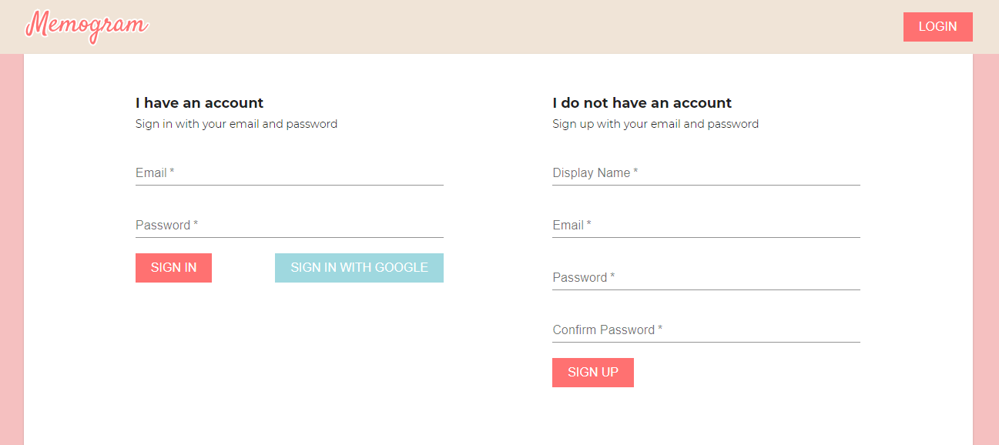
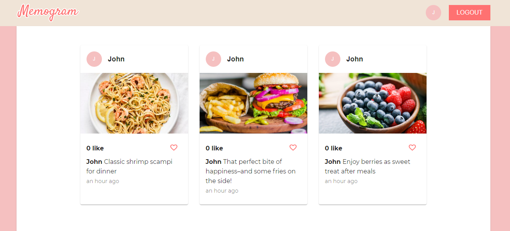

# Memogram

This is a simplified version of Instagram. 

Public can view posts that are posted by users. 

Sign in using Goggle provider or create a new user with an email and password.

Login user can access to their own profile, add post and like post.

## Create React App

This project was bootstrapped with [Create React App](https://github.com/facebook/create-react-app).

## Built with

[Firebase](https://firebase.google.com/)
- Authentication
- Cloud Firestore
- Storage

[Material-UI](https://material-ui.com/)
